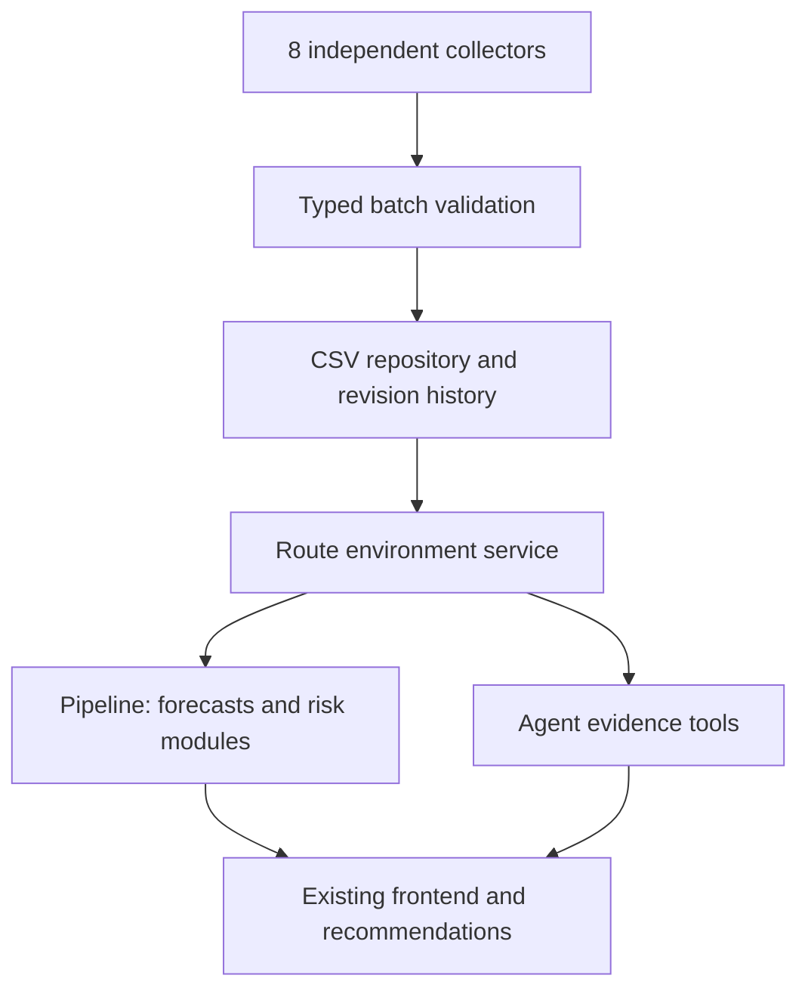

# Module Boundaries

bootstrap.py is the only composition root. contracts defines schemas and protocols. Collectors handle HTTP requests and normalization without CSV access. The repository owns persistence, locks, deduplication, and revisions. The service independently matches each metric to sources and evaluates freshness. The pipeline collects sources sequentially, isolates source failures, refreshes summaries, and validates prediction, risk, and recommendation outputs. The frontend and agent consume structured data through HTTP or the shared reader.

pipeline.refresh continues after individual source failures. Repository disk-write failures still propagate rather than being reported as successful ingestion. route_environment_latest is a cached materialized view; get_route_environment recalculates state at the requested time. pipeline.run projects rainfall into the existing Conditions contract to preserve the original prediction and recommendation interfaces while exposing complete environment and risks outputs.

## Matching Extension

StartPointStrategy uses the first original GeoJSON coordinate as the route representative point. Each station metric independently selects the nearest station with usable observations for that metric, preferring fresh stations. A source beyond 15 km produces missing. If no fresh source is available, the nearest stale source is selected and labelled stale.

WBGT and heat stress do not assume that temperature stations supply those metrics. Regional sources follow the curated TOML assignments. Station distance is a straight-line spherical distance, not a travel distance.

Future along-route sampling can be introduced through geometry_strategy and an extended segment-level matching and aggregation strategy. The current implementation does not claim along-route precision.

## PostgreSQL Migration

Implement EnvironmentRepository with a PostgreSQLRepository and replace its construction in bootstrap. Preserve observation keys, revision history, as_of availability rules, source_kind isolation, concurrency guarantees, and typed return contracts.

Collectors, the service, the frontend, and agent consumers should not need CSV-path changes. Prediction snapshot storage remains a repository responsibility. The static route catalog can remain CSV/GeoJSON or move into database tables. This version has no production database driver or paid database dependency.

## Legacy Modules

modules/collector.py and modules/spatial.py are retained as v1 reference implementations and are no longer composed by bootstrap. Active implementations live in collectors/ and services/. Do not add new metrics to the legacy files.
