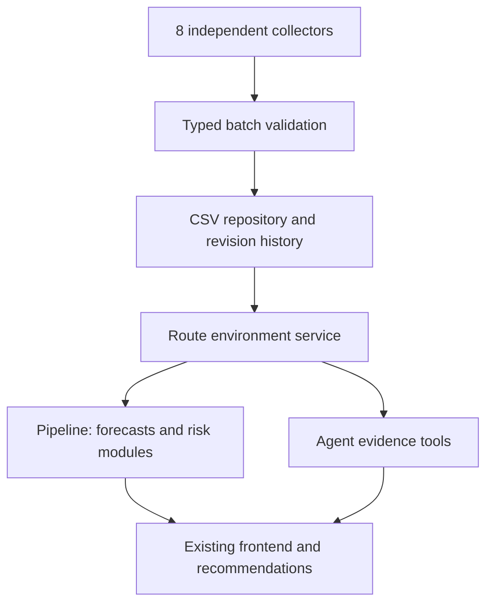

# Module boundaries

bootstrap.py 是唯一实现组装入口。contracts 定义数据/Protocol；collector 只负责 HTTP 与标准化，不读写 CSV；repository 只管持久化、锁、去重、修订；service 独立处理每个 metric 的来源和时效；pipeline 顺序采集、隔离失败、刷新汇总、验证预测/推荐输出。前端/agent 只通过 HTTP 或统一 reader 获取结构化数据。

pipeline.refresh 不因单个来源失败整体中断，但 repository 的磁盘写入失败仍向上报错，不假装成功。route_environment_latest 是缓存视图；get_route_environment 在指定时间重算状态。pipeline.run 把 rainfall 投影回原 Conditions 合约以保留已跑通的推荐/预测接口，同时提供完整 environment 与 risks。

## Matching extension

StartPointStrategy 使用原 GeoJSON 第一坐标作为代表点。各气象指标独立从该指标实际有可用观测的站点选最近来源，优先 fresh，超出 15km 为 missing；若无 fresh 则选最近 stale 并明确标记。WBGT/heat stress 不假定与温度站共用。regional 按 TOML 的人工区域映射。站点距离为球面直线距离，不是到达距离。未来沿线采样可注入 geometry_strategy，并扩展逐段匹配/汇总策略；当前没有虚构沿线精度。

## PostgreSQL migration

用 PostgreSQLRepository 实现 EnvironmentRepository，bootstrap 替换构造，保留同样的 key、revision/as_of、source_kind 隔离、锁和 typed 返回契约。collector、service、frontend、agent 无需改 CSV 路径。预测快照的存储策略仍属于 repository。静态 catalog 可以继续保留 CSV/GeoJSON或迁移到表。没有生产数据库驱动、没有付费依赖。

原 modules/collector.py 与 modules/spatial.py 保留为 v1 参考，不再由 bootstrap 调用；活动实现是 collectors/ 和 services/。不要在这两个旧文件继续加新指标。
